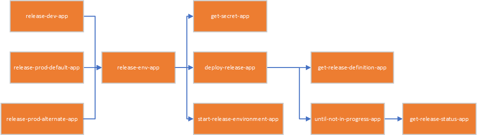

# shared-infra-devops

DevOps Automation for the [shared-infra projects](https://github.com/vplauzon/shared-infra)

## Manage projects.json

During the build we embed the projects.json file within the input parameters file using [create-input-parameters.py](create-input-parameters.py).

## Azure DevOps REST API

We use the [Azure DevOps REST API](https://docs.microsoft.com/en-us/rest/api/azure/devops/?view=azure-devops-rest-5.0) through Logic Apps.

## Logic Apps

Here is a graph of the Logic Apps dependencies:

